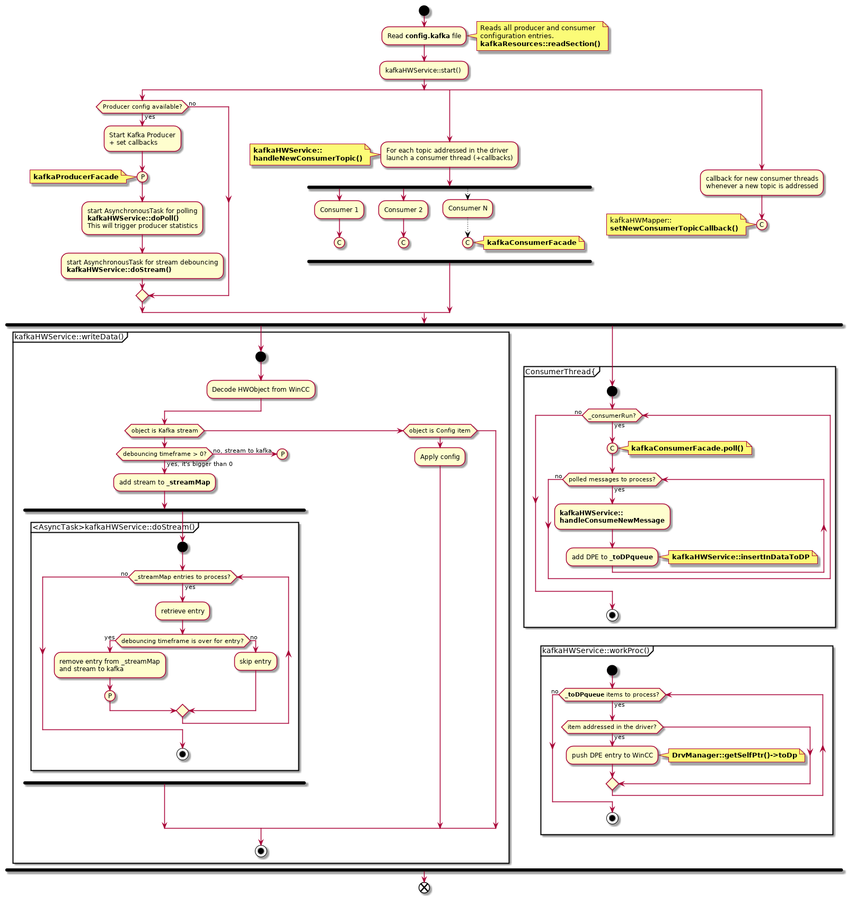

CERN HSE Computing  (HSE-TS-CS)
==================================================

Contact email: adrien.ledeul@cern.ch

WinCC OA Kafka Driver
==================================================


# Table of contents #
1. [Description](#toc1)
2. [Libraries](#toc2)

    2.1 [Installation of libraries](#toc2.1)

3. [Compilation](#toc3)
    
    3.1. [To build the driver](#toc3.1)

    3.2. [To Install](#toc3.2)

    3.3. [Run](#toc3.3)

4. [Config file](#toc4)

    4.1 [Keytab (CERN Only)](#toc4.1)

5. [WinCC OA Installation](#toc5)

6. [Kafka Driver Technical Documentation](#toc6)

    6.1. [Main entry points](#toc6.1)

    6.2. [Addressing DPEs with the Kafka driverl](#toc6.2)

    * 6.2.1 [Data types](#toc6.2.1)
    * 6.2.2 [For streaming](#toc6.2.2)
    * 6.2.3 [For data ingestion](#toc6.2.3)
    * 6.2.4 [Adding a new type](#toc6.2.4)

    6.3 [Driver configuration](#toc6.3)

    6.4 [Activity diagram](#toc6.4)


<a name="toc1"></a>

# 1. Description #

This is a generic WinCC OA driver used to stream and/or ingest data via Kafka. 
The user has the following possibilites:

* Run a producer
* Run one or several consumers (one consumer per topic)
* Run both a producer and/or consumer(s)

<a name="toc2"></a>

# 2. Libraries #

* C++11 STL
* WinCC OA API libraries
* [librdkafka](./libs) under BSD2 (available as git submodule. Our working version commit is @ `8695b9d6`)
* [cppkafka](./libs) under BSD2 (available as git submodule. Our working version commit is @ `df4eaa07`)
* cyrus-sasl-gssapi
* cyrus-sasl-devel
* boost
* cmake
* openssl-dev


<a name="toc2.1"></a>

## 2.1 Installation of libraries ##
`librdkafka` and `cppkafka` are open source libraries, available on Github. They are both built from source and added to this project as git sub-modules.  

After cloning this repository run 

    make installLibs

This will perform the following:

    1. Retrieve the `librdkafka` and `cppkafka` git submodules in the `libs` folder
    2. Install `boost`, `cyrus-sasl-gssapi`, `cyrus-sasl-devel`, `openssl-dev` and `cmake` libraries (if needed)
    3. Launch the build&install process for `librdkafka`
    4. Launch the build&install process for `cppkafka`
    NOTE: you need sudo rights

<a name="toc3"></a>

# 3. Compilation:
Project has a Makefile. Note that you can also set the `PVSS_PROJ_PATH` environment variable beforehand. 

<a name="toc3.1"></a>

## 3.1 To build the driver

	make

<a name="toc3.2"></a>

## 3.2 To install

	make install PVSS_PROJ_PATH=<path_to_pvss_project_bin_folder>
    

<a name="toc3.3"></a>

## 3.3 Run

It can be run from the WinCCOA Console or from command line and it will require the `config.kafka` file:

    ./WINCCOAkafkaDrv -num <driver_number> -proj <project_name> +config config.kafka

<a name="toc4"></a>

# 4. Config file #

The `config.kafka` file has to be present under the WinCCOA project folder `config`.

Here, producer and consumer configs can be specified (based on your own needs). These will be parsed by the driver at startup thanks to the `PRODUCER.CONFIG.` keyword for producer and the `CONSUMER.CONFIG.` keyword for the consumer(s).

Here is an example config file:
```
[kafka]
PRODUCER.CONFIG.metadata.broker.list = dbnile-kafka-a-8.cern.ch:9093,dbnile-kafka-b-8.cern.ch:9093,dbnile-kafka-c-8.cern.ch:9093
PRODUCER.CONFIG.security.protocol = SASL_SSL
PRODUCER.CONFIG.sasl.mechanism = GSSAPI
PRODUCER.CONFIG.sasl.kerberos.service.name = kafka
PRODUCER.CONFIG.sasl.kerberos.principal = asavules
PRODUCER.CONFIG.sasl.kerberos.keytab = /home/asavules/Workspace/as.keytab
PRODUCER.CONFIG.group.id = test-consumer-group
PRODUCER.CONFIG.statistics.interval.ms = 60000
CONSUMER.CONFIG.metadata.broker.list = dbnile-kafka-a-8.cern.ch:9093,dbnile-kafka-b-8.cern.ch:9093,dbnile-kafka-c-8.cern.ch:9093
CONSUMER.CONFIG.security.protocol = SASL_SSL
CONSUMER.CONFIG.sasl.mechanism = GSSAPI
CONSUMER.CONFIG.sasl.kerberos.service.name = kafka
CONSUMER.CONFIG.sasl.kerberos.principal = asavules
CONSUMER.CONFIG.sasl.kerberos.keytab = /home/asavules/Workspace/as.keytab
CONSUMER.CONFIG.statistics.interval.ms = 60000
CONSUMER.CONFIG.group.id = remustest_meas_consumer
CONSUMER.CONFIG.enable.auto.commit = true
CONSUMER.CONFIG.auto.offset.reset = latest

```
In this config file you can add other producer or consumer configuration entries(see [Kafka Official Documentation](https://kafka.apache.org/documentation)).

<a name="toc4.1"></a>

## 4.1 Keytab (CERN Only) ##

To be able to access kafka, you will need to create a keytab. 

Please refer to official user guide, section `How to generate a keytab file`: 
[CERN Kafka Official User Guide](https://nile-user-guide.web.cern.ch/nile-user-guide/kafka/security.html) 

For example with NICE user `jdoe`:
```
    cern-get-keytab --user --keytab jdoe.keytab --login jdoe
```

Edit the `config/config.kafka` file in your WinCC OA project and update the `CONSUMER.CONFIG.sasl.kerberos.keytab` and/or  `PRODUCER.CONFIG.sasl.kerberos.keytab` entry to point to your keytab file + the `CONSUMER.CONFIG.sasl.kerberos.principal` and/or `PRODUCER.CONFIG.sasl.kerberos.principal` to your NICE username.

For example: 

    [kafka]
    PRODUCER.CONFIG.metadata.broker.list = dbnile-kafka-a-8.cern.ch:9093,dbnile-kafka-b-8.cern.ch:9093,dbnile-kafka-c-8.cern.ch:9093
    PRODUCER.CONFIG.security.protocol = SASL_SSL
    PRODUCER.CONFIG.sasl.mechanism = GSSAPI
    PRODUCER.CONFIG.sasl.kerberos.service.name = kafka
    PRODUCER.CONFIG.sasl.kerberos.principal = jdoe
    PRODUCER.CONFIG.sasl.kerberos.keytab = /home/jdoe/Workspace/jdoe.keytab
    PRODUCER.CONFIG.group.id = test-producer-group-demo
    PRODUCER.CONFIG.statistics.interval.ms = 60000

    CONSUMER.CONFIG.metadata.broker.list = dbnile-kafka-a-8.cern.ch:9093,dbnile-kafka-b-8.cern.ch:9093,dbnile-kafka-c-8.cern.ch:9093
    CONSUMER.CONFIG.security.protocol = SASL_SSL
    CONSUMER.CONFIG.sasl.mechanism = GSSAPI
    CONSUMER.CONFIG.sasl.kerberos.service.name = kafka
    CONSUMER.CONFIG.sasl.kerberos.principal = jdoe
    CONSUMER.CONFIG.sasl.kerberos.keytab = /home/jdoe/Workspace/jdoe.keytab
    CONSUMER.CONFIG.statistics.interval.ms = 60000
    CONSUMER.CONFIG.group.id = remustest_demo_consumer
    CONSUMER.CONFIG.enable.auto.commit = true


<a name="toc5"></a>

# 5. WinCC OA Installation #

Under the [winccoa folder](./winccoa/) you will find the following files that you need to copy to your project in the corresponding paths:

* [dplist/kafka_driver_config.dpl](./winccoa/dplist/kafka_driver_config.dpl) : it contains `internal driver & CONFIG_KAFKA DPs`. Once you've successfully launched the driver in the WinCC project manangement, you can import it via the ASCII Manager(refer to the official WinCC OA Documentation).

Notes:

    * This is a specific dump of the REMUS redundant project DPs 
    * The internal driver number in the dump is 2. If it's unavailable to you, try to modify the dump file directly. 

* [dplist/panels/para/address_kafka.pnl](./winccoa/panels/para/address_kafka.pnl) : a panel that you can use in para for kafka addressing. If you install this panel, then you will also need the WinCC OA scripts that go along:

    * [scripts/userDrivers.ctl](./winccoa/scripts/userDrivers.ctl)
    * [scripts/userPara.ctl](./winccoa/scripts/userPara.ctl)
    * [scripts/libs/kafka_dpe_addressing.ctl](./winccoa/scripts/libs/kafka_dpe_addressing.ctl): Optional, functions to set peripth address from ctl


See [6.3 Driver configuration](#toc6.3) section for a brief descprition of relevant CONFIG_KAFKA DPEs.

<a name="toc6"></a>
# 6. ready-to-launch project #
A ready-to-launch WinCCOA 3.16 kafka consumer demo project available here:

* [winccoa316_demo_project/kafka_producer_consumer_demo.zip](./winccoa316_demo_project/kafka_producer_consumer_demo.zip)

To make it work, generate a file user.keytab in the config folder, and update the config files: config/config config/config.kafka with the appropriate project path and user names

<a name="toc7"></a>

# 7. Kafka Driver Technical Documentation #

<a name="toc7.1"></a>

## 7.1 Main entry points ##
After the driver startup, the main entry points in the driver are:
    
* kafkaHwService::writeData() -> WinCC to Driver communication

    This is how the kafka streaming is performed. Thanks to the addressing `<TOPIC>$<KEY>[$<DEBOUNCING_TIMEFRAME>]`, the driver will be able to stream to the right topic.

* kafkaHwService::workProc()  -> Driver to WinCC communication

    This is how we push data to WinCC from Kafka. Thanks to the addressing `<TOPIC>$<KEY>`,the driver will be able to map the data ingested from the respective Kafka topic to the WinCC DPE.

Please refer to the WinCC documentation for more information on the WinCC OA API. 
For more info on the debouncing, see [Remus RealTime Evolution - KAFKA presentation](./doc/REMUS_RealTime_Evolution_-_KAFKA.pptx).

<a name="toc7.2"></a>

## 7.2 Addressing DPEs with the Kafka driver ##

<a name="toc7.2.1"></a>

### 7.2.1 Data Types ###
When the kafka driver pushes a DPE value to WinCC, a transformation takes place. See [Transformations folder](./Transformations). We are currently supporting the following data types for the periphery address:

--------------------------------------------------------------------------------------------------------------------------------
| WinCC DataType    | Transformation class                                          | Periphery data type value                 |
| ------------------| --------------------------------------------------------------| ----------------------------------------- |
| bool              | [kafkaBoolTrans.cxx](./Transformations/kafkaBoolTrans.cxx)    | 1000 (TransUserType def in WinCC OA API)  |
| uint8             | [kafkaUint8Trans.cxx](./Transformations/kafkaUint8Trans.cxx)  | 1001 (TransUserType + 1)                  |
| int32             | [kafkaInt32Trans.cxx](./Transformations/kafkaInt32Trans.cxx)  | 1002 (TransUserType + 2)                  |
| int64             | [kafkaInt64Trans.cxx](./Transformations/kafkaInt64Trans.cxx)  | 1003 (TransUserType + 3)                  |
| float             | [kafkaFloatTrans.cxx](./Transformations/kafkaFloatTrans.cxx)  | 1004 (TransUserType + 4)                  |
| string            | [kafkaStringTrans.cxx](./Transformations/kafkaStringTrans.cxx)| 1005 (TransUserType + 5)                  |
| time              | [kafkaTimeTrans.cxx](./Transformations/kafkaTimeTrans.cxx)    | 1006 (TransUserType + 6)                  |
--------------------------------------------------------------------------------------------------------------------------------

<a name="toc7.2.2"></a>

### 7.2.2 For streaming ###

The periphery address data type has to be set to `string` (1005). 

The direction in the periphery  has to be set to `OUT`. The addressing is generic: `<TOPIC>$<KEY>[$<DEBOUNCING_TIMEFRAME>]`. The `$DEBOUNCING_TIMEFRAME` is optional and if not set then it is 0 by default.


* Example 1 

    remustest_demo$MeasurementJSON123$200

    Gives us :
    * The kafka topic: remustest_demo
    * The key key: MeasurementJSON123
    * Debouncing timeframe: 200 milliseconds

* Example 2

    remustest_demo$MeasurementJSON123

    Gives us :
    * The kafka topic: remustest_demo
    * The key key: MeasurementJSON123
    * No debouncing timeframe


For more info on the addressing, see [Remus RealTime Evolution - KAFKA presentation](./doc/REMUS_RealTime_Evolution_-_KAFKA.pptx).

<a name="toc6.2.3"></a>

### 7.2.3 For data ingestion ###


The direction in the periphery address has to be set to `IN`. The addressing is generic: `<TOPIC>$<KEY>`. 

For example 

    remustest_demo$MeasurementJSON123

    Gives us :
    * The kafka topic: remustest_demo
    * The key key: MeasurementJSON123

There is a ready-to-launch WinCCOA 3.16 kafka consumer demo project available here: 
    * [winccoa316_demo_project/kafka_producer_consumer_demo.zip](./winccoa316_demo_project/kafka_producer_consumer_demo.zip)
    
 To make it work,  generate a file user.keytab in the config folder, and update the config files:
config/config
config/config.kafka 
with the appropriate project apth and user names


<a name="toc7.2.4"></a>

### 7.2.4 Adding a new transformation ###

To add a new transformation you need to do the following: 

* create a define in `kafkaHWMappeer.hxx`

        #define kafkaDrvDoubleTransType (TransUserType + 7)
 
* handle the new transformation type in `kafkaHWMapper::addDpPa()`
* implement the transformation type class. The important functions here are 
    
    * `::toPeriph(...)`  for WinCC OA to Kafka driver transformation
    * `::toVar(...)`   for Kafka driver to WinCC OA transformation


<a name="toc6.3"></a>

## 7.3 Driver Configuration ##

Available via the WinCC OA `CONFIG_KAFKA` DataPoint, we have the following 

| Config DPE                | Direction    | Addressing                    | Type      | Description                                                                        |
| -------------             | ---------    | -------------                 | --------- | -------------                                                                      |
| DebugLvl                  | OUT          | DEBUGLVL                      | INT32     | Debug Level for logging. You can use this to debug issues. (default 0)             |
| DebouncingThreadInterval  | OUT          | DEBOUNCINGTHREADINTERVAL      | INT32     | In milliseconds. The sleep interval for the debouncing thread (default 50 ms)      |
| MaxPollRecords            | OUT          | MAXPOLLRECORDS                | INT32     | MAximum number of records should the consumer poll retrieve (default 1000)         |
| IN.ProducerStatsDP        | IN           | PRODUCER_STATISTICS           | STRING    | This is where the driver periodically pushes statistics from kafka producer (json) |
| IN.ProducerAllBrokersDown | IN           | PRODUCER_ALL_BROKERS_DOWN     | BOOL      | Set by the when all brokers are down for the producer.            |                |
| IN.ConsumerStatsDP        | IN           | CONSUMER_STATISTICS           | STRING    | This is where the driver periodically pushes statistics from kafka consumer (json) |


<a name="toc7.4"></a>

## 7.4 Activity Diagram ##


