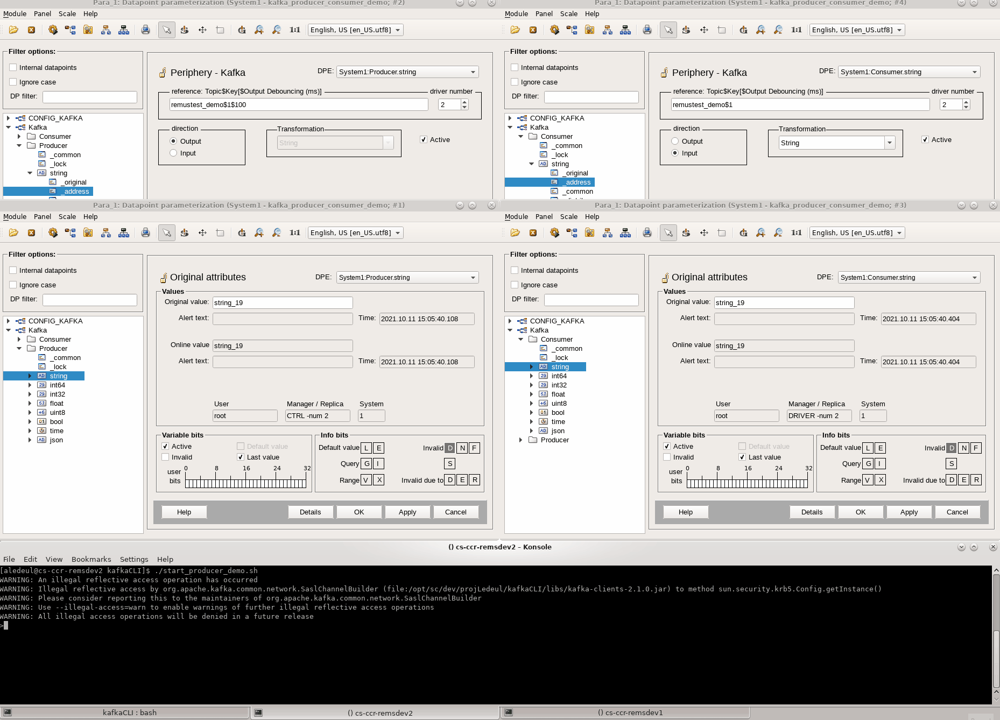

CERN HSE Computing  (HSE-TS-CS)
==================================================

Contact email: hse-ts-cs@cern.ch

WinCC OA Kafka Driver
==================================================


# Table of contents #
1. [Description](#toc1)
2. [Libraries](#toc2)

    2.1 [Requirements for external libraries](#toc2.1)

3. [Compilation](#toc3)
    
    3.1. [To build the driver](#toc3.1)

    3.2. [Build options](#toc3.2)

    3.3. [To install and update](#toc3.3)

    3.4. [Run](#toc3.4)

4. [Config file](#toc4)

    4.1 [Keytab (CERN Only)](#toc4.1)

5. [WinCC OA Installation](#toc5)

6. [Ready-to-launch project (CERN only)](#toc6)

	6.1. [Project demo set-up](#toc6.1)
	* 6.1.1 [Download & unzip](#toc6.1.1)
	* 6.1.2 [Kafka Topic](#toc6.1.2)
	* 6.1.3 [Keytab](#toc6.1.3)
	* 6.1.4 [Config](#toc6.1.4)
	* 6.1.5 [Install libraries](#toc6.1.5)
	* 6.1.6 [Run the project](#toc6.1.6)

7. [Kafka Driver Technical Documentation](#toc7)

    7.1. [Main entry points](#toc7.1)

    7.2. [Addressing DPEs with the Kafka driverl](#toc7.2)

    * 7.2.1 [Data types](#toc7.2.1)
    * 7.2.2 [For streaming](#toc7.2.2)
    * 7.2.3 [For data ingestion](#toc7.2.3)
    * 7.2.4 [Adding a new type](#toc7.2.4)

    7.3 [Driver configuration](#toc7.3)

    7.4 [Activity diagram](#toc7.4)


<a name="toc1"></a>

# 1. Description #

This is a generic WinCC OA driver used to stream and/or ingest data via Kafka. 
The user has the following possibilities:

* Run a producer
* Run one or several consumers (one consumer per topic)
* Run both a producer and/or consumer(s)

<a name="toc2"></a>

# 2. Libraries #

* C++11 STL
* WinCC OA API libraries
* [cppkafka](https://github.com/mfontanini/cppkafka) under BSD2 (check CMakeLists for release version)
* [librdkafka](https://github.com/confluentinc/librdkafka) under BSD2 (check CMakeLists for release version)


<a name="toc2.1"></a>

## 2.1 Requirements for external libraries ##
`librdkafka` and `cppkafka` are open source libraries, available on Github. They are both built from source via CMake.  

You need to make sure to install the following libs on your system:
    * cyrus-sasl-gssapi
    * boost
    * cmake
    * openssl-dev
    
<a name="toc3"></a>

# 3. Compilation:
The project is CMake enabled.
Note that if you set the `PVSS_PROJ_PATH` environment variable beforehand, you can install and update the driver via the `install` and `update` targets.

<a name="toc3.1"></a>

## 3.1 To build the driver

    export PVSS_PROJ_PATH=<path_to_pvss_project_folder>
    mkdir build
    cd build
    cmake ..
    make -j

<a name="toc3.2"></a>

## 3.2 Build options

The default CMake build type is `Release`. The follow build types are taken into account:

| Build Type | Details    |
|------------|----------------------------------|
| Release    | Default, 03 optimization         |
| Debug      | gdb enabled, no optimization     |
| Coverage   | gcov enabled, no optimization    |
-------------------------------------------------

To enable a specific build type, run:

    cmake -DCMAKE_BUILD_TYPE=<build_type> ..

For Code Coverage make sure you have `lcov` installed. At the end of your tests, perform the following to get the html coverage report:

    make coverage

If `valgrind` is installed, you can also run the tests with valgrind:

    make valgrind
Once you are done with the tests, you can stop the valgrind process with:

    make kill


<a name="toc3.3"></a>

## 3.3 To install and update

In order to install the driver in the `PVSS_PROJ_PATH/bin`, run:

	make install

Making changes to the driver and updating it are simplified by using the `update` target, triggering a `clean`, `install` (and `kill` the driver):

    make update

The `kill` target will simply terminate the running process. Combined with the `always` setting of the driver in WinCCOA, this will ensure that the driver is always up to date.

<a name="toc3.3"></a>

## 3.3 Run

It can be run from the WinCCOA Console or from command line and it will require the `config.kafka` driver_config_file:

    ./WINCCOAkafkaDrv -num <driver_number> -proj <project_name> +config <driver_config_file>

If you want to run the driver from the `build` folder (i.e. debug, coverage or valgrind mode) you can call:

    make run

CMake will extract/parse the following information:

| Variable              | Details                                                                       |
|-----------------------|-------------------------------------------------------------------------------|
| project_name          | The PVSS project name from  PVSS_PROJ_PATH environment variable               |
| driver_number         | The driver number from the $PVSS_PROJ_PATH/config/progs file. Defaults to 999.|
| driver_config_file    | The driver config file from the $PVSS_PROJ_PATH/config/progs file.            |


# 4. Config file #

The `config.kafka` file has to be present under the WinCCOA project folder `config`.

Here, producer and consumer configs can be specified (based on your own needs). These will be parsed by the driver at startup thanks to the `PRODUCER.CONFIG.` keyword for producer and the `CONSUMER.CONFIG.` keyword for the consumer(s).

Here is an example config file:
```
[kafka]
PRODUCER.CONFIG.metadata.broker.list = dbnile-kafka-a-8.cern.ch:9093,dbnile-kafka-b-8.cern.ch:9093,dbnile-kafka-c-8.cern.ch:9093
PRODUCER.CONFIG.security.protocol = SASL_SSL
PRODUCER.CONFIG.sasl.mechanism = GSSAPI
PRODUCER.CONFIG.sasl.kerberos.service.name = kafka
PRODUCER.CONFIG.sasl.kerberos.principal = asavules
PRODUCER.CONFIG.sasl.kerberos.keytab = /home/asavules/Workspace/as.keytab
PRODUCER.CONFIG.group.id = test-consumer-group
PRODUCER.CONFIG.statistics.interval.ms = 60000
CONSUMER.CONFIG.metadata.broker.list = dbnile-kafka-a-8.cern.ch:9093,dbnile-kafka-b-8.cern.ch:9093,dbnile-kafka-c-8.cern.ch:9093
CONSUMER.CONFIG.security.protocol = SASL_SSL
CONSUMER.CONFIG.sasl.mechanism = GSSAPI
CONSUMER.CONFIG.sasl.kerberos.service.name = kafka
CONSUMER.CONFIG.sasl.kerberos.principal = asavules
CONSUMER.CONFIG.sasl.kerberos.keytab = /home/asavules/Workspace/as.keytab
CONSUMER.CONFIG.statistics.interval.ms = 60000
CONSUMER.CONFIG.group.id = remustest_meas_consumer
CONSUMER.CONFIG.enable.auto.commit = true
CONSUMER.CONFIG.auto.offset.reset = latest

```
In this config file you can add other producer or consumer configuration entries(see [Kafka Official Documentation](https://kafka.apache.org/documentation)).

<a name="toc4.1"></a>

## 4.1 Keytab (CERN Only) ##

To be able to access kafka, you will need to create a keytab. 

Please refer to official user guide, section `How to generate a keytab file`: 
[CERN Kafka Official User Guide](https://nile-user-guide.web.cern.ch/nile-user-guide/kafka/security.html) 

For example with NICE user `jdoe`:
```
    cern-get-keytab --user --keytab jdoe.keytab --login jdoe
```

Edit the `config/config.kafka` file in your WinCC OA project and update the `CONSUMER.CONFIG.sasl.kerberos.keytab` and/or  `PRODUCER.CONFIG.sasl.kerberos.keytab` entry to point to your keytab file + the `CONSUMER.CONFIG.sasl.kerberos.principal` and/or `PRODUCER.CONFIG.sasl.kerberos.principal` to your NICE username.

For example: 

    [kafka]
    PRODUCER.CONFIG.metadata.broker.list = dbnile-kafka-a-8.cern.ch:9093,dbnile-kafka-b-8.cern.ch:9093,dbnile-kafka-c-8.cern.ch:9093
    PRODUCER.CONFIG.security.protocol = SASL_SSL
    PRODUCER.CONFIG.sasl.mechanism = GSSAPI
    PRODUCER.CONFIG.sasl.kerberos.service.name = kafka
    PRODUCER.CONFIG.sasl.kerberos.principal = jdoe
    PRODUCER.CONFIG.sasl.kerberos.keytab = /home/jdoe/Workspace/jdoe.keytab
    PRODUCER.CONFIG.group.id = test-producer-group-demo
    PRODUCER.CONFIG.statistics.interval.ms = 60000

    CONSUMER.CONFIG.metadata.broker.list = dbnile-kafka-a-8.cern.ch:9093,dbnile-kafka-b-8.cern.ch:9093,dbnile-kafka-c-8.cern.ch:9093
    CONSUMER.CONFIG.security.protocol = SASL_SSL
    CONSUMER.CONFIG.sasl.mechanism = GSSAPI
    CONSUMER.CONFIG.sasl.kerberos.service.name = kafka
    CONSUMER.CONFIG.sasl.kerberos.principal = jdoe
    CONSUMER.CONFIG.sasl.kerberos.keytab = /home/jdoe/Workspace/jdoe.keytab
    CONSUMER.CONFIG.statistics.interval.ms = 60000
    CONSUMER.CONFIG.group.id = remustest_demo_consumer
    CONSUMER.CONFIG.enable.auto.commit = true


<a name="toc5"></a>

# 5. WinCC OA Installation #

Under the [winccoa folder](./winccoa/) you will find the following files that you need to copy to your pre-existing project in the corresponding paths:

* [dplist/kafka_driver_config.dpl](./winccoa/dplist/kafka_driver_config.dpl) : it contains `CONFIG_KAFKA DPEs`. It is used to set the driver options such as log levels and to retreive consumer and producer statistics. Once you've successfully launched the driver in the WinCC project management, you can import it via the ASCII Manager(refer to the official WinCC OA Documentation).

Notes:

    * The internal driver number in the dump is 2. If it's unavailable to you, try to modify the dump file directly. 

* [dplist/panels/para/address_kafka.pnl](./winccoa/panels/para/address_kafka.pnl) : a panel that you can use in para for kafka addressing. If you install this panel, then you will also need the WinCC OA scripts that go along:

    * [scripts/userDrivers.ctl](./winccoa/scripts/userDrivers.ctl)
    * [scripts/userPara.ctl](./winccoa/scripts/userPara.ctl)

In order to set up the addressing of kafka DPE form a control script, you may use the folowing library:
    * [scripts/libs/kafka_dpe_addressing.ctl](./winccoa/scripts/libs/kafka_dpe_addressing.ctl).
Usage:

	`kafkaAddress_addressDPE("Consumer.myDPE", kafkaAddress_DATA_TYPE_STRING, kafkaAddress_MODE_IN, 2, "my_kafka_topic", "my_kafka_key");`
	`kafkaAddress_addressDPE("Producer.myDPE", kafkaAddress_DATA_TYPE_STRING, kafkaAddress_MODE_OUT, 2, "my_kafka_topic", "my_kafka_key", 100);`


See [7.3 Driver configuration](#toc7.3) section for a brief descprition of relevant CONFIG_KAFKA DPEs.

<a name="toc6"></a>
# 6. Ready-to-launch project (CERN only) #
A ready-to-launch WinCCOA 3.16 kafka consumer demo project available here:
* [winccoa316_demo_project/kafka_producer_consumer_demo.zip](./winccoa316_demo_project/kafka_producer_consumer_demo.zip)

<a name="toc6.1"></a>

## 6.1 Project demo set-up ##


<a name="toc6.1.1"></a>

### 6.1.1 Download & unzip

Download [winccoa316_demo_project/kafka_producer_consumer_demo.zip](./winccoa316_demo_project/kafka_producer_consumer_demo.zip).

Unzip it on a CentOS7 machine that have WinCCOA 3.16 installed. You will need sudo rights to install libraries.

<a name="toc6.1.2"></a>

### 6.1.2 Kafka Topic

The topic `remustest_demo` from where the values are retrieved in the demo is available on the CERN `kafka-gptn` cluster. 

To be able to retrieve the values for the demo project, you need to get access for this topic. Please subscribe to the [kafka-remustest-demo](https://e-groups.cern.ch/e-groups/Egroup.do?egroupId=10328116) egroup.

<a name="toc6.1.3"></a>

## 6.1.3. Keytab

To be able to access kafka, you will need to create a keytab, to replace the empty one in config/ .

go to [PROJECT PATH]/config
and run

cern-get-keytab --user --keytab user.keytab --login [NICE login]

See [4.1. Keytab (CERN Only)](#toc4.1) section for more details

<a name="toc6.1.4"></a>

## 6.1.4. Config

Edit the `config/config.kafka` file and update:

    * `CONSUMER.CONFIG.sasl.kerberos.keytab` path to your keytab file (consumer).
    * `CONSUMER.CONFIG.sasl.kerberos.principal` your CERN's NICE username (consumer).
    * `PRODUCER.CONFIG.sasl.kerberos.keytab` path to your keytab file (producer).
    * `PRODUCER.CONFIG.sasl.kerberos.principal` your CERN's NICE username (producer).

Edit the `config/config` file to point to the appropriate project path.

<a name="toc6.1.5"></a>

## 6.1.5. Install libraries

First run :

    sudo yum install cyrus-sasl-gssapi

Then go to `bin/libs/` and run:

    ./installLocal.sh

This will copy the libraries and update dependencies. Note that you need sudo rights. 

<a name="toc6.1.6"></a>

## 6.1.6. Run the project

Simply register then start the project in WinCCOA. 

A UI manager will launch para module, where producer and consumer DPEs are already set-up and running.




The manager -f kafka_producer_example.lst is continuously doing dpSets into the Producer DPEs, that are sending messages to the kafka topic "remustest_demo". The messages are transmitted to Kafka, then read by the Consumer DPEs.

Since the messages are going through Kafka, they can of course be read/write from external software (other WCCOA project, java, python, MQTT, ...) communicating with the same topic, as demonstrated on the screeshot, where messages are sent through the kafka command line tool (https://kafka.apache.org/quickstart)

(Optional) Running the manager -f kafka_addressing_example.lst will demonstrate a dynamic addressing of kafka DPE, both producers and consumers, from Control scripts.

<a name="toc7"></a>

# 7. Kafka Driver Technical Documentation #

<a name="toc7.1"></a>

## 7.1 Main entry points ##
After the driver startup, the main entry points in the driver are:
    
* kafkaHwService::writeData() -> WinCC to Driver communication

    This is how the kafka streaming is performed. Thanks to the addressing `<TOPIC>$<KEY>[$<DEBOUNCING_TIMEFRAME>]`, the driver will be able to stream to the right topic.

* kafkaHwService::workProc()  -> Driver to WinCC communication

    This is how we push data to WinCC from Kafka. Thanks to the addressing `<TOPIC>$<KEY>`,the driver will be able to map the data ingested from the respective Kafka topic to the WinCC DPE.

Please refer to the WinCC documentation for more information on the WinCC OA API. 
For more info on the debouncing, see [Remus RealTime Evolution - KAFKA presentation](./doc/REMUS_RealTime_Evolution_-_KAFKA.pptx).

<a name="toc7.2"></a>

## 7.2 Addressing DPEs with the Kafka driver ##

<a name="toc7.2.1"></a>

### 7.2.1 Data Types ###
When the kafka driver pushes a DPE value to WinCC, a transformation takes place. See [Transformations folder](./Transformations). We are currently supporting the following data types for the periphery address:

--------------------------------------------------------------------------------------------------------------------------------
| WinCC DataType    | Transformation class                                          | Periphery data type value                 |
| ------------------| --------------------------------------------------------------| ----------------------------------------- |
| bool              | [kafkaBoolTrans.cxx](./Transformations/kafkaBoolTrans.cxx)    | 1000 (TransUserType def in WinCC OA API)  |
| uint8             | [kafkaUint8Trans.cxx](./Transformations/kafkaUint8Trans.cxx)  | 1001 (TransUserType + 1)                  |
| int32             | [kafkaInt32Trans.cxx](./Transformations/kafkaInt32Trans.cxx)  | 1002 (TransUserType + 2)                  |
| int64             | [kafkaInt64Trans.cxx](./Transformations/kafkaInt64Trans.cxx)  | 1003 (TransUserType + 3)                  |
| float             | [kafkaFloatTrans.cxx](./Transformations/kafkaFloatTrans.cxx)  | 1004 (TransUserType + 4)                  |
| string            | [kafkaStringTrans.cxx](./Transformations/kafkaStringTrans.cxx)| 1005 (TransUserType + 5)                  |
| time              | [kafkaTimeTrans.cxx](./Transformations/kafkaTimeTrans.cxx)    | 1006 (TransUserType + 6)                  |
--------------------------------------------------------------------------------------------------------------------------------

<a name="toc7.2.2"></a>

### 7.2.2 For streaming ###

The periphery address data type has to be set to `string` (1005). 

The direction in the periphery  has to be set to `OUT`. The addressing is generic: `<TOPIC>$<KEY>[$<DEBOUNCING_TIMEFRAME>]`. The `$DEBOUNCING_TIMEFRAME` is optional and if not set then it is 0 by default.


* Example 1 

    remustest_demo$MeasurementJSON123$200

    Gives us :
    * The kafka topic: remustest_demo
    * The key key: MeasurementJSON123
    * Debouncing timeframe: 200 milliseconds

* Example 2

    remustest_demo$MeasurementJSON123

    Gives us :
    * The kafka topic: remustest_demo
    * The key key: MeasurementJSON123
    * No debouncing timeframe


For more info on the addressing, see [Remus RealTime Evolution - KAFKA presentation](./doc/REMUS_RealTime_Evolution_-_KAFKA.pptx).

<a name="toc7.2.3"></a>

### 7.2.3 For data ingestion ###


The direction in the periphery address has to be set to `IN`. The addressing is generic: `<TOPIC>$<KEY>`. 

For example 

    remustest_demo$MeasurementJSON123

    Gives us :
    * The kafka topic: remustest_demo
    * The key key: MeasurementJSON123

<a name="toc7.2.4"></a>

### 7.2.4 Adding a new transformation ###

To add a new transformation you need to do the following: 

* create a define in `kafkaHWMappeer.hxx`

        #define kafkaDrvDoubleTransType (TransUserType + 7)
 
* handle the new transformation type in `kafkaHWMapper::addDpPa()`
* implement the transformation type class. The important functions here are 
    
    * `::toPeriph(...)`  for WinCC OA to Kafka driver transformation
    * `::toVar(...)`   for Kafka driver to WinCC OA transformation


<a name="toc7.3"></a>

## 7.3 Driver Configuration ##

Available via the WinCC OA `CONFIG_KAFKA` DataPoint, we have the following 

| Config DPE                | Direction    | Addressing                    | Type      | Description                                                                        |
| -------------             | ---------    | -------------                 | --------- | -------------                                                                      |
| DebugLvl                  | OUT          | DEBUGLVL                      | INT32     | Debug Level for logging. You can use this to debug issues. (default 0)             |
| DebouncingThreadInterval  | OUT          | DEBOUNCINGTHREADINTERVAL      | INT32     | In milliseconds. The sleep interval for the debouncing thread (default 50 ms)      |
| MaxPollRecords            | OUT          | MAXPOLLRECORDS                | INT32     | MAximum number of records should the consumer poll retrieve (default 1000)         |
| IN.ConsumerStatsDP        | IN           | CONSUMER_STATISTICS           | STRING    | This is where the driver periodically pushes statistics from kafka consumer (json) |
| IN.ProducerStatsDP        | IN           | PRODUCER_STATISTICS           | STRING    | This is where the driver periodically pushes statistics from kafka producer (json) |
| IN.ProducerAllBrokersDown | IN           | PRODUCER_ALL_BROKERS_DOWN     | BOOL      | Set by the when all brokers are down for the producer.                             |
| IN.NoConsumerConfig       | IN           | CONSUMER_NO_CONFIG            | BOOL      | Indicates there is no consumer configuration available.                            |
| IN.NoProducerConfig       | IN           | PRODUCER_NO_CONFIG            | BOOL      | Indicates there is no producer configuration available.                            |


<a name="toc7.4"></a>

## 7.4 Activity Diagram ##


